# Project-Portfolio-Analyzing-and-Formatting-Superstore-Sales-Data

## Project Description
This project involves reformatting and analyzing Superstore sales data to answer critical business questions while addressing issues such as incorrect data types and missing values. The primary goal is to extract actionable insights that can inform business strategies and enhance overall performance.

The analysis will utilize a combination of Excel, SQL, and PowerBI, following a structured approach to ensure comprehensive and reliable results. The process will encompass six key parts of data analysis:

* [Defining the Problems](#defining-the-problems)
* [Data Preparation](#data-preparation)
* [Data Cleaning and Processing](#data-cleaning-and-processing)
* [Data Analysis](#data-analysis) 
* [Data Visualization](#data-visualization)
* [Recommendations](#recommendations)

  
## Defining the Problems
#### Which products, locations, and customer segments should the company focus on and which should it avoid to maximize profits?
What trends are emerging and what recommendations can be made based on the analysis findings?

## Data Preparation
* Data source: Datacamp.com 
* Superstore data includes two tables: orders and products
* Orders table contains 50,906 rows and 22 columns, covering orders from 2011-2014
* Products table contains 10,292 rows and 5 columns, covering products in 3 categories: technology, furniture, and office supplies


Model view shows us the contents of two tables, with product_id acting as the primary key. In the orders table, product_id serves as the foreign key that links to the products table's primary key. This relationship allows us to join the two tables and enrich our order data with additional product details, ensuring a comprehensive dataset for analysis.

## Data Cleaning and Processing
#### Tools: Excel, MySQL
* Observation of data in Excel
* Checking for missing data using filters and conditional formatting
* Removing duplicates
* Formatting columns (dates, numbers, currency)
* Filling in missing data in MySQL

Let's start by loading the data into SQL. From our initial analysis in Excel, we discovered that there are missing values in the quantity column. First, we'll identify these missing values to understand the gaps in our data.
Next, we'll calculate the unit price for the rows where quantity is available. This will involve dividing sales by quantity. With these unit prices in hand, we'll then estimate the missing quantities for the rows where quantity is NULL. We'll achieve this by joining the data on common attributes like product_id and discount.
To manage this process efficiently, we'll create a temporary table named calculated_quantities to store the missing values. Finally, we'll update the orders table, filling in the missing quantity values with our calculated amounts. This structured approach ensures our data's completeness and accuracy.

```sql
CREATE TEMPORARY TABLE calculated_quantities AS   -- Filling in missing quantity data
WITH missing_values AS (
  SELECT product_id, 
         discount, 
         region,
         sales
  FROM orders 
  WHERE quantity IS NULL   -- Find rows with NULL quantity
),
unit_price AS (
  SELECT 
    o.product_id,
    o.discount, 
    o.market, 
    o.region, 
    o.sales, 
    o.quantity, 
    o.sales / o.quantity AS unit_price 
  FROM orders AS o
  RIGHT JOIN missing_values AS m 
  ON o.product_id = m.product_id 
  AND o.discount = m.discount 
  WHERE o.quantity IS NOT NULL   -- Find rows with non-NULL quantity
)
SELECT 
  m.product_id, 
  m.discount, 
  m.region,
  m.sales, 
  ROUND((m.sales/u.unit_price), 0) AS calculated_quantity   -- Calculate missing quantity
FROM missing_values AS m 
INNER JOIN unit_price AS u 
ON m.product_id = u.product_id 
AND m.discount = u.discount;

UPDATE orders   -- Update table with calculated quantities
JOIN calculated_quantities
ON orders.product_id = calculated_quantities.product_id
AND orders.discount = calculated_quantities.discount
AND orders.sales = calculated_quantities.sales
SET orders.quantity = calculated_quantities.calculated_quantity
WHERE orders.quantity IS NULL;
```

## Data Analysis
#### Methods: SQL for exploratory data analysis

### Main Questions:

[1. What are the total sales and total profits for each year?](#1-What-are-the-total-sales-and-total-profits-for-each-year)

[2. What are the total sales and total profits per quarter?](#2-What-are-the-total-sales-and-total-profits-per-quarter)

[3. Which region generates the highest sales and profits?](#3-Which-region-generates-the-highest-sales-and-profits)

[4. Which country and city bring in the highest sales and profits?](#4-Which-country-and-city-bring-in-the-highest-sales-and-profits)

[5. What is the relationship between discount and sales, and what is the total discount per category?](#5-What-is-the-relationship-between-discount-and-sales-and-what-is-the-total-discount-per-category)

[6. Which category generates the highest sales and profits in each region and country?](#6-Which-category-generates-the-highest-sales-and-profits-in-each-region-and-country)

[7. Which subcategory generates the highest sales and profits in each region and country?](#7-Which-subcategory-generates-the-highest-sales-and-profits-in-each-region-and-country)

[8. What are the names of the most and least profitable products?](#8-What-are-the-names-of-the-most-and-least-profitable-products)

[9. Which segment contributes the most to our profits and sales?](#9-Which-segment-contributes-the-most-to-our-profits-and-sales)

[10. How many unique customers do we have in total, and how many are there per region and country?](#10-How-many-unique-customers-do-we-have-in-total-and-how-many-are-there-per-region-and-country)

[11. Which customers bring the most profit? ](#11-Which-customers-bring-the-most-profit)

[12. What is the average delivery time per class and in total?](#12-What-is-the-average-delivery-time-per-class-and-in-total)

### 1. What are the total sales and total profits for each year?
#### Total sales and profits per year
We can observe data for 2011, 2012, 2013, and 2014 based on grouping by year from the order dates.
```sql
 SELECT 
    YEAR(order_date) AS total_year, 
    ROUND(SUM(sales), 2) AS total_revenue, 
    ROUND(SUM(profit), 2) AS total_profit
  FROM orders
  GROUP BY  total_year
  ORDER BY total_year DESC;
```
The following output is produced by the above code:


The results show a consistent increase in both sales and profits from 2011 to 2014. Sales grew from 2250.94K in 2011 to 4276.7K in 2014, while profits rose from 247.13K in 2011 to 498.17K in 2014. This indicates a steady improvement in Superstore financial performance over the years.


### 2. What are the total sales and total profits per quarter?
Let's examine the total sales and profits per quarter. This analysis helps identify the periods when our company has had the most significant impact. By doing this, we can tailor our future operations to maximize our resources, such as advertising, customer service, and overall presence during those times of the year.

#### Best performing quarters from 2011-2014
```sql
WITH cte AS (
  SELECT 
    QUARTER(o.order_date) AS revenue_quarter,
    ROUND(SUM(o.sales), 2) AS order_total 
  FROM orders AS o
  LEFT JOIN products AS p
  ON o.product_id = p.product_id
  GROUP BY revenue_quarter
  ORDER BY revenue_quarter DESC
)
SELECT 
  CASE 
    WHEN revenue_quarter = 1 THEN 'Q1'
    WHEN revenue_quarter = 2 THEN 'Q2'
    WHEN revenue_quarter = 3 THEN 'Q3'
    ELSE 'Q4'
  END AS quarters,
  order_total 
FROM cte
ORDER BY revenue_quarter DESC;
```

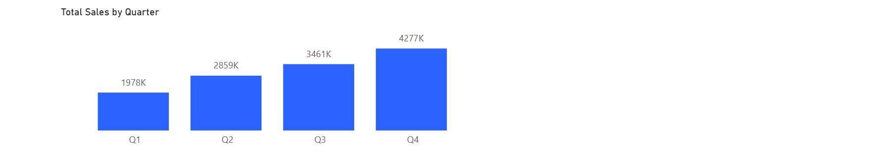

The results shown above can help us understand which quarters were the most profitable from 2011 to 2014, aiding in planning business areas like marketing, inventory levels, and optimizing human resources during peak periods. This can also pave the way for strategic investments.

#### Total sales and profits per quarter

```sql
SELECT 
    YEAR(o.order_date) AS revenue_year,
    QUARTER(o.order_date) AS revenue_quarter,
    ROUND(SUM((o.sales)), 2) AS order_total 
FROM orders AS o
LEFT JOIN products AS p
ON o.product_id = p.product_id
GROUP BY revenue_year, revenue_quarter
ORDER BY revenue_year DESC, revenue_quarter DESC;
```


The data reveals that the fourth quarter, encompassing October, November, and December, is our peak period for sales and profits. By analyzing this data, we can develop effective operational strategies, noting the clear buildup from January to December, followed by a dip in the first three months of the year. 
Let's now take a look at how sales and profits are distributed across the different regions.

### 3. Which region generates the highest sales and profits?

#### Total sales, profits, and profit margins by region
```sql
SELECT 
  region, 
  ROUND(SUM(sales), 2) AS total_sales,
  ROUND(SUM(profit), 2) AS total_profit,
  ROUND((SUM(profit) / SUM(sales)) * 100, 2) AS profit_margin
FROM orders
GROUP BY region
ORDER BY total_sales DESC;
```
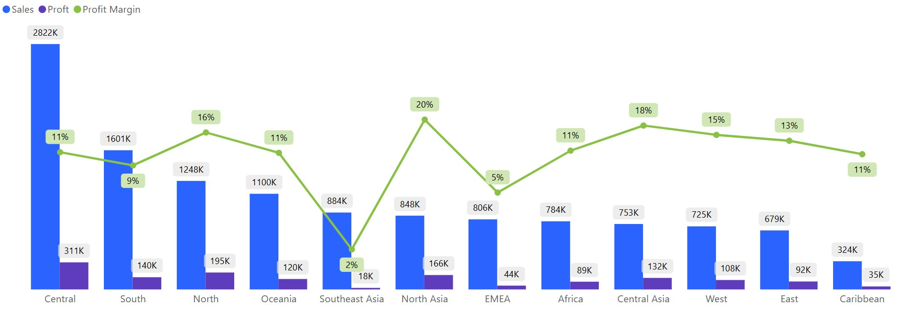


We can observe that the Central region has the highest total sales and brings us the highest profits. The North region also demonstrates strong performance with a high profit margin. These two regions are definitely areas of interest if we want to maximize our profits and expand our business. The South region, while generating substantial revenue, has a comparatively lower profit margin, indicating potential areas for efficiency improvements.

Despite generating significant revenue, the Central region does not produce the same level of profit as some other regions. Therefore, the Central region should be closely monitored as we might consider reallocating resources to more profitable regions. When we look at profit margins, which measure a company’s profitability as the percentage of revenue kept as profit, it reveals that the North and Central regions are particularly effective. Despite generating almost half of the Central region's revenue, the North region maintains a high profit margin, showcasing efficient operations.
By considering these insights, we can develop targeted strategies for each region, optimizing our overall performance.

#### Average Order Value (AOV) and Average Number of Products per Order by region
```sql
SELECT
  region,
  ROUND(SUM(sales) / COUNT(DISTINCT order_id), 2) AS average_order_value,
  ROUND(SUM(quantity) / COUNT(DISTINCT order_id), 2) AS average_products_per_order
FROM orders
GROUP BY region
ORDER BY average_order_value DESC;
```


### 4. Which country and city bring in the highest sales and profits?


#### Top 10 countries' total sales and profits with their profit margins
```sql
SELECT 
  country, 
  ROUND(SUM(sales), 2) AS total_sales,
  ROUND(SUM(profit), 2) AS total_profit,
  ROUND((SUM(profit) / SUM(sales)) * 100, 2) AS profit_margin
FROM orders
GROUP BY country
ORDER BY total_profit DESC
LIMIT 10;

```

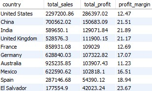

#### Bottom 10 countries' total sales and profits
```sql
SELECT 
  country, 
  ROUND(SUM(sales), 2) AS total_sales,
  ROUND(SUM(profit), 2) AS total_profit,
  ROUND((SUM(profit) / SUM(sales)) * 100, 2) AS profit_margin
FROM orders
GROUP BY country
ORDER BY total_profit ASC
LIMIT 10;
```


#### Top 10 cities' total sales and profits with their profit margins
```sql
SELECT 
  country, 
  city,
  ROUND(SUM(sales), 2) AS total_sales,
  ROUND(SUM(profit), 2) AS total_profit,
  ROUND((SUM(profit) / SUM(sales)) * 100, 2) AS profit_margin
FROM orders
GROUP BY country, city
ORDER BY total_profit DESC
LIMIT 10;
```


#### Bottom 10 cities' total sales and profits with their profit margins
```sql
SELECT 
  country, 
  city,
  ROUND(SUM(sales), 2) AS total_sales,
  ROUND(SUM(profit), 2) AS total_profit,
  ROUND((SUM(profit) / SUM(sales)) * 100, 2) AS profit_margin
FROM orders
GROUP BY country, city
ORDER BY total_profit ASC
LIMIT 10;
```


### 5. What is the relationship between discount and sales, and what is the total discount per category?


#### Discount vs Avg Sales
```sql
SELECT 
  discount, 
  ROUND(AVG(sales), 2) AS Avg_Sales
FROM orders
GROUP BY discount
ORDER BY discount;
```
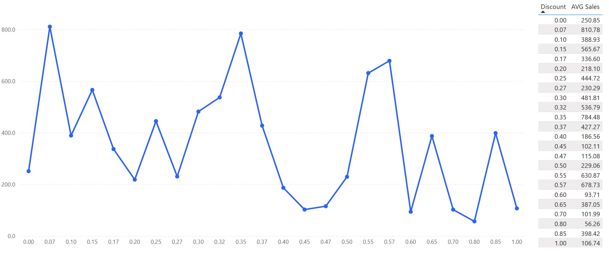
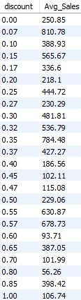 

#### Most discounted categories
```sql
SELECT 
  p.category, 
  SUM(o.discount) AS total_discount
FROM orders AS o 
LEFT JOIN products AS p
ON o.product_id = p.product_id
GROUP BY category
ORDER BY total_discount DESC;
```

 

#### Most discounted subcategories
```sql
SELECT 
  p.sub_category, 
  SUM(o.discount) AS total_discount
FROM orders AS o 
LEFT JOIN products AS p
ON o.product_id = p.product_id
GROUP BY p.sub_category
ORDER BY total_discount DESC;
```

 

### 6. Which category generates the highest sales and profits in each region and country?

#### Categories with their total sales, profits, and profit margins
```sql
SELECT 
  p.category,
  ROUND(SUM(o.sales), 2) AS total_sales,
  ROUND(SUM(o.profit), 2) AS total_profit,
  ROUND(SUM(o.profit) / SUM(o.sales) * 100, 2) AS profit_margin
FROM orders AS o 
LEFT JOIN products AS p 
ON o.product_id = p.product_id
GROUP BY p.category
ORDER BY total_profit DESC;
```

 

#### Highest total sales and profits per category in each region
```sql
SELECT 
  o.region,
  p.category,
  ROUND(SUM(o.sales), 2) AS total_sales,
  ROUND(SUM(o.profit), 2) AS total_profit,
  ROUND(SUM(o.profit) / SUM(o.sales) * 100, 2) AS profit_margin
FROM orders AS o 
LEFT JOIN products AS p 
ON o.product_id = p.product_id
GROUP BY o.region, p.category
ORDER BY total_profit DESC;
```

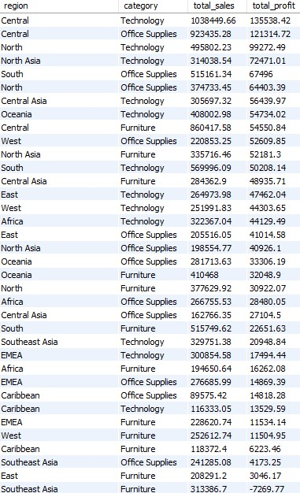 

#### Highest total sales and profits per category in each country
```sql
SELECT 
  o.country,
  p.category,
  ROUND(SUM(o.sales), 2) AS total_sales,
  ROUND(SUM(o.profit), 2) AS total_profit,
  ROUND(SUM(o.profit) / SUM(o.sales) * 100, 2) AS profit_margin
FROM orders AS o 
LEFT JOIN products AS p 
ON o.product_id = p.product_id
GROUP BY o.country, p.category
ORDER BY total_profit DESC;
```
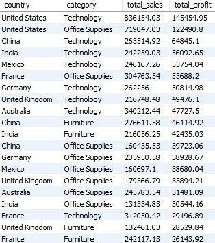 

#### Lowest total sales and profits per category in each country
```sql
SELECT 
  o.country,
  p.category,
  ROUND(SUM(o.sales), 2) AS total_sales,
  ROUND(SUM(o.profit), 2) AS total_profit,
  ROUND(SUM(o.profit) / SUM(o.sales) * 100, 2) AS profit_margin
FROM orders AS o 
LEFT JOIN products AS p 
ON o.product_id = p.product_id
GROUP BY o.country, p.category
ORDER BY total_profit ASC;
```
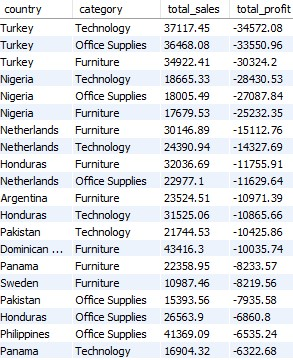 


### 7. Which subcategory generates the highest sales and profits in each region and country?

#### Subcategories with their total sales, profits, and profit margins
```sql
SELECT 
  p.sub_category,
  ROUND(SUM(o.sales), 2) AS total_sales,
  ROUND(SUM(o.profit), 2) AS total_profit,
  ROUND(SUM(o.profit) / SUM(o.sales) * 100, 2) AS profit_margin
FROM orders AS o 
LEFT JOIN products AS p 
ON o.product_id = p.product_id
GROUP BY p.sub_category
ORDER BY total_profit DESC;
```

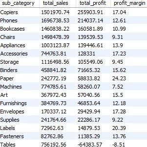 

#### Subcategories with the highest total sales and profits in each region
```sql
WITH ranked_categories AS (
  SELECT
    o.region,
    p.sub_category,
    ROUND(SUM(o.sales), 2) AS total_sales,
    ROUND(SUM(o.profit), 2) AS total_profit,
    ROW_NUMBER() OVER (PARTITION BY o.region ORDER BY SUM(o.profit) DESC) AS profit_rank
  FROM orders AS o
  LEFT JOIN products AS p 
  ON o.product_id = p.product_id
  GROUP BY o.region, p.sub_category
)
SELECT 
  region,
  sub_category,
  total_sales,
  total_profit
FROM ranked_categories
WHERE profit_rank = 1;
```

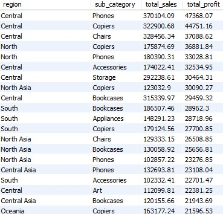 

#### Subcategories with the lowest total sales and profits in each region
```sql
SELECT 
  p.sub_category,
  ROUND(SUM(o.sales - o.discount), 2) AS total_sales,
  ROUND(SUM(o.profit), 2) AS total_profit
FROM orders AS o
LEFT JOIN products AS p 
ON o.product_id = p.product_id
GROUP BY p.sub_category
ORDER BY total_profit ASC
LIMIT 10;
```
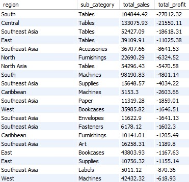 

#### Highest total sales and profits per subcategory in each country
```sql
SELECT 
  o.country,
  p.sub_category,
  ROUND(SUM(o.sales - o.discount), 2) AS total_sales,
  ROUND(SUM(o.profit), 2) AS total_profit
FROM orders AS o
LEFT JOIN products AS p 
ON o.product_id = p.product_id
GROUP BY p.sub_category, o.country
ORDER BY total_profit DESC
LIMIT 10;
```
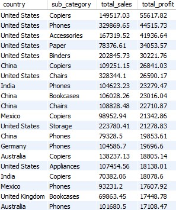 

#### Lowest total sales and profits per subcategory in each country
```sql
SELECT 
  o.country,
  p.sub_category,
  ROUND(SUM(o.sales - o.discount), 2) AS total_sales,
  ROUND(SUM(o.profit), 2) AS total_profit
FROM orders AS o
LEFT JOIN products AS p 
ON o.product_id = p.product_id
GROUP BY p.sub_category, o.country
ORDER BY total_profit ASC;
```

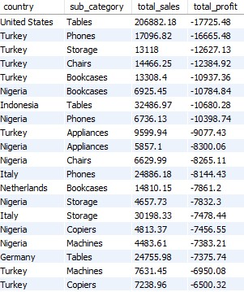 

### 8. What are the names of the most and least profitable products?

#### Top 10 most profitable products
```sql
SELECT 
  p.product_name,
  ROUND(SUM(o.sales - o.discount), 2) AS total_sales,
  ROUND(SUM(o.profit), 2) AS total_profit
FROM orders AS o
LEFT JOIN products AS p 
ON o.product_id = p.product_id
GROUP BY p.product_name
ORDER BY total_profit DESC
LIMIT 10;
```
 

#### Top 10 least profitable products
```sql
SELECT 
  p.product_name,
  ROUND(SUM(o.sales - o.discount), 2) AS total_sales,
  ROUND(SUM(o.profit), 2) AS total_profit
FROM orders AS o
LEFT JOIN products AS p 
ON o.product_id = p.product_id
GROUP BY p.product_name
ORDER BY total_profit ASC
LIMIT 10;
```
 

### 9. Which segment contributes the most to our profits and sales?

#### Segments ordered by total profits
```sql
SELECT 
  segment, 
  ROUND(SUM(sales), 2) AS total_sales, 
  ROUND(SUM(profit), 2) AS total_profit
FROM orders
GROUP BY segment
ORDER BY total_profit DESC;
```
 
### 10. How many unique customers do we have in total, and how many are there per region and country?

#### Total number of customers
```sql
SELECT 
  COUNT(DISTINCT customer_id) AS total_customers
FROM orders;
```
 

-- Total customers per region
```sql
SELECT 
  region, 
  COUNT(DISTINCT customer_id) AS total_customers
FROM orders
GROUP BY region
ORDER BY total_customers DESC;
```
 

#### Top 10 countries with the most customers
```sql
SELECT 
  country, 
  COUNT(DISTINCT customer_id) AS total_customers
FROM orders
GROUP BY country
ORDER BY total_customers DESC
LIMIT 10;
```
 

#### Top 10 countries with the fewest customers
```sql
SELECT 
  country, 
  COUNT(DISTINCT customer_id) AS total_customers
FROM orders
GROUP BY country
ORDER BY total_customers ASC
LIMIT 10;
```
 

### 11. Which customers bring the most profit?

#### Identify repeat purchases by customers
```sql
SELECT 
  customer_id,
  COUNT(*) AS purchase_count
FROM orders
GROUP BY customer_id
HAVING COUNT(*) > 1
ORDER BY purchase_count DESC;
```
 

#### Top 10 customers who generated the most sales compared to total profits
```sql
SELECT 
  customer_id, 
  ROUND(SUM(sales), 2) AS total_sales,
  ROUND(SUM(profit), 2) AS total_profit
FROM orders
GROUP BY customer_id
ORDER BY total_sales DESC
LIMIT 10;
```
 

### 12. What is the average delivery time per class and in total?

#### Average delivery time
```sql
SELECT 
  AVG(DATEDIFF(ship_date, order_date)) AS delivery_time
FROM orders;
```
 

#### Calculate delivery time and percentage of total orders
```sql
WITH delivery AS (
  SELECT 
    order_id,
    order_date,
    ship_date,
    DATEDIFF(ship_date, order_date) AS delivery_time,
    quantity
  FROM orders
),
total_orders AS (
  SELECT COUNT(order_id) AS total_order_count FROM delivery
)
SELECT 
  delivery_time, 
  COUNT(order_id) AS order_count,
  ROUND((COUNT(order_id) / (SELECT total_order_count FROM total_orders)) * 100, 2) AS percentage_of_total
FROM delivery
GROUP BY delivery_time
ORDER BY delivery_time DESC;
```
 

#### Avg delivery time and standard deviation per region
```sql
SELECT 
  region,
  AVG(DATEDIFF(ship_date, order_date)) AS average_delivery_time,
  STDDEV(DATEDIFF(ship_date, order_date)) AS stdev_delivery_time
FROM orders
GROUP BY region
ORDER BY average_delivery_time ASC;
```
 

#### Avg delivery time per  shipping mode
```sql
SELECT 
  ship_mode,
  AVG(DATEDIFF(ship_date, order_date)) AS avg_shipping_time
FROM orders
GROUP BY ship_mode
ORDER BY avg_shipping_time DESC;
```

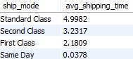 

## 5. Data Visualization
#### Tool: PowerBI
Interactive dashboard in PowerBI based on collected data

## 6. Recommendations

#### Findings and Recommendations:

* Profits and sales are gradually improving, with Q4 being a key period
* Best performing regions are West and East; focus should be on these regions
* California, New York, and Washington are the most profitable states, while Texas, Ohio, and Pennsylvania incur losses
* Technology and Office Supplies are the best categories, while Furniture needs improvement
* Among subcategories, Copiers and Paper yield the highest profits, while Tables and Bookcases yield the highest losses
* Consumer segment yields the highest profits
* Loyalty program should reward the most loyal customers, even if they incur losses
