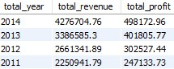

# Project-Portfolio-Analyzing-and-Formatting-Superstore-Sales-Data

## Project Description
This project involves reformatting and analyzing Superstore sales data to answer critical business questions while addressing issues such as incorrect data types and missing values. The primary goal is to extract actionable insights that can inform business strategies and enhance overall performance.

The analysis will utilize a combination of Excel, SQL, and PowerBI, following a structured approach to ensure comprehensive and reliable results. The process will encompass six key parts of data analysis:

* [Defining the Problems](#defining-the-problems)
* [Data Preparation](#data-preparation)
* [Data Cleaning and Processing](#data-cleaning-and-processing)
* [Data Analysis](#data-analysis) 
* [Data Visualization](#data-visualization)
* [Recommendations](#recommendations)

  
## Defining the Problems
#### Which products, locations, and customer segments should the company focus on and which should it avoid to maximize profits?
What trends are emerging and what recommendations can be made based on the analysis findings?

## Data Preparation
* Data source: Datacamp.com 
* Superstore data includes two tables: orders and products
* Orders table contains 50,906 rows and 22 columns, covering orders from 2011-2014
* Products table contains 10,292 rows and 5 columns, covering products in 3 categories: technology, furniture, and office supplies

## Data Cleaning and Processing
#### Tools: Excel, MySQL
* Observation of data in Excel
* Checking for missing data using filters and conditional formatting
* Removing duplicates
* Formatting columns (dates, numbers, currency)
* Filling in missing data in MySQL

```sql
-- Filling in missing quantity data
CREATE TEMPORARY TABLE calculated_quantities AS
WITH missing_values AS (
  SELECT product_id, 
         discount, 
         region,
         sales
  FROM orders 
  WHERE quantity IS NULL  -- Find rows with NULL quantity
),
unit_price AS (
  SELECT 
    o.product_id,
    o.discount, 
    o.market, 
    o.region, 
    o.sales, 
    o.quantity, 
    o.sales / o.quantity AS unit_price 
  FROM orders AS o
  RIGHT JOIN missing_values AS m 
  ON o.product_id = m.product_id 
  AND o.discount = m.discount 
  WHERE o.quantity IS NOT NULL  -- Find rows with non-NULL quantity
)
SELECT 
  m.product_id, 
  m.discount, 
  m.region,
  m.sales, 
  ROUND((m.sales/u.unit_price), 0) AS calculated_quantity  -- Calculate missing quantity
FROM missing_values AS m 
INNER JOIN unit_price AS u 
ON m.product_id = u.product_id 
AND m.discount = u.discount;
```

```sql
-- Update table with calculated quantities
UPDATE orders
JOIN calculated_quantities
ON orders.product_id = calculated_quantities.product_id
AND orders.discount = calculated_quantities.discount
AND orders.sales = calculated_quantities.sales
SET orders.quantity = calculated_quantities.calculated_quantity
WHERE orders.quantity IS NULL;
```

## Data Analysis
#### Methods: SQL for exploratory data analysis

### Main Questions:

[1. What are the total sales and total profits for each year?](#1-What-are-the-total-sales-and-total-profits-for-each-year?)

[2. What are the total sales and total profits per quarter?](#2-What-are-the-total-sales-and-total-profits-per-quarter?)

[3. Which region generates the highest sales and profits?](#3-Which-region-generates-the-highest-sales-and-profits?)

[4. Which country and city bring in the highest sales and profits?](#4-Which-country-and-city-bring-in-the-highest-sales-and-profits?)

[5. What is the relationship between discount and sales, and what is the total discount per category?](#5-What-is-the-relationship-between-discount-and-sales-and-what-is-the-total-discount-per-category?)

[6. Which category generates the highest sales and profits in each region and country?](#6-Which-category-generates-the-highest-sales-and-profits-in-each-region-and-country?)

[7. Which subcategory generates the highest sales and profits in each region and country?](#7-Which-subcategory-generates-the-highest-sales-and-profits-in-each-region-and-country?)

[8. What are the names of the most and least profitable products?](#8-What-are-the-names-of-the-most-and-least-profitable-products?)

[9. Which segment contributes the most to our profits and sales?](#9-Which-segment-contributes-the-most-to-our-profits-and-sales?)

[10. How many unique customers do we have in total, and how many are there per region and country?](#10-How-many-unique-customers-do-we-have-in-total-and-how-many-are-there-per-region-and-country?)

[11. Which customers bring the most profit? ](#11-Which-customers-bring-the-most-profit?)

[12. What is the average delivery time per class and in total?](#12-What-is-the-average-delivery-time-per-class-and-in-total?)

### 1. What are the total sales and total profits for each year?
Total sales and profits per year
   
```sql
 SELECT 
    YEAR(order_date) AS total_year, 
    ROUND(SUM(sales - discount), 2) AS total_revenue, 
    ROUND(SUM(profit), 2) AS total_profit
  FROM orders
  GROUP BY  total_year
  ORDER BY total_year DESC;
```



Total sales and profits per quarter

```sql
SELECT 
    YEAR(o.order_date) AS revenue_year,
    QUARTER(o.order_date) AS revenue_quarter,
    ROUND(SUM((o.sales - o.discount)), 2) AS order_total 
FROM orders AS o
LEFT JOIN products AS p
ON o.product_id = p.product_id
GROUP BY revenue_year, revenue_quarter
ORDER BY revenue_year DESC, revenue_quarter DESC;
```
Best performing quarters from 2011-2014

```sql
WITH cte AS (
  SELECT 
    QUARTER(o.order_date) AS revenue_quarter,
    ROUND(SUM(o.sales), 2) AS order_total 
  FROM orders AS o
  LEFT JOIN products AS p
  ON o.product_id = p.product_id
  GROUP BY revenue_quarter
  ORDER BY revenue_quarter DESC
)
SELECT 
  CASE 
    WHEN revenue_quarter = 1 THEN 'Q1'
    WHEN revenue_quarter = 2 THEN 'Q2'
    WHEN revenue_quarter = 3 THEN 'Q3'
    ELSE 'Q4'
  END AS quarters,
  order_total 
FROM cte
ORDER BY revenue_quarter DESC;
```

#### Geographic Analysis:
3. Highest sales and profits by region

```sql
SELECT 
region, 
ROUND(SUM(sales-discount),2) AS total_sales,
ROUND(SUM(profit),2) AS total_profit,
ROUND((SUM(profit)/SUM(sales-discount)) * 100,2) AS profit_margin
FROM orders
GROUP BY region
ORDER BY total_sales DESC;
```
5. Sales and profits by state and city

```sql
-- Top 10 Cities by Profit
SELECT 
state, 
city,
ROUND(SUM(sales-discount),2) AS total_sales,
ROUND(SUM(profit),2) AS total_profit,
ROUND((SUM(profit)/SUM(sales-discount)) * 100,2) AS profit_margin
FROM orders
GROUP BY state, city
ORDER BY total_profit DESC
LIMIT 10;
-- Bottom 10 Cities by Profit
SELECT 
state, 
city,
ROUND(SUM(sales-discount),2) AS total_sales,
ROUND(SUM(profit),2) AS total_profit,
ROUND((SUM(profit)/SUM(sales-discount)) * 100,2) AS profit_margin
FROM orders
GROUP BY state, city
ORDER BY total_profit ASC
LIMIT 10;
```
   
#### Product Analysis:
5. Most profitable categories and subcategories
   
6. Most profitable products

7. Gross margin analysis: calculating gross margin for different product categories
8. Price variability analysis: how price variability affects sales and profits

#### Customer Analysis:
9. Customer segments
10. Total number of customers
11. Customer retention analysis: repeat purchases and retention rates. Loyalty program

#### Sales Analysis:
12. Relationship between discounts and sales
13. Basket analysis: average order value and number of products per order

#### Delivery Time Analysis:
14. Delivery time of products (quantity and %)
15. Average delivery time
16. Differences in delivery time based on location
17. Deviation analysis
18. Type of products vs. delivery time

## 5. Data Visualization
#### Tool: PowerBI
Interactive dashboard in PowerBI based on collected data

## 6. Recommendations

#### Findings and Recommendations:

* Profits and sales are gradually improving, with Q4 being a key period
* Best performing regions are West and East; focus should be on these regions
* California, New York, and Washington are the most profitable states, while Texas, Ohio, and Pennsylvania incur losses
* Technology and Office Supplies are the best categories, while Furniture needs improvement
* Among subcategories, Copiers and Paper yield the highest profits, while Tables and Bookcases yield the highest losses
* Consumer segment yields the highest profits
* Loyalty program should reward the most loyal customers, even if they incur losses
