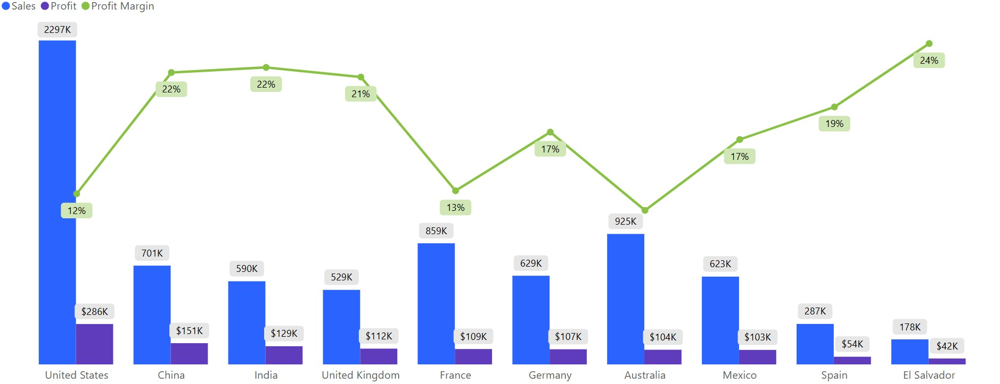
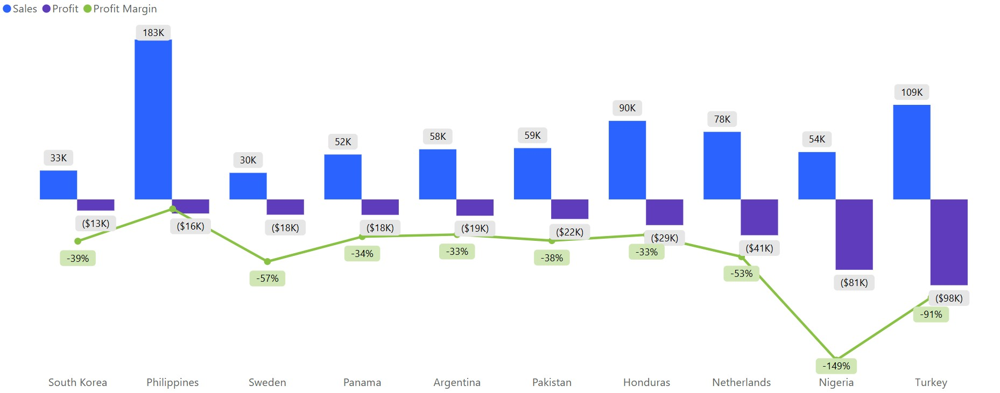
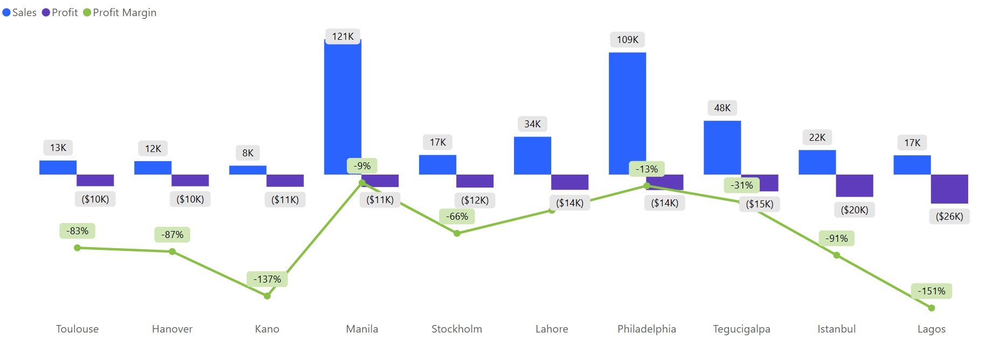
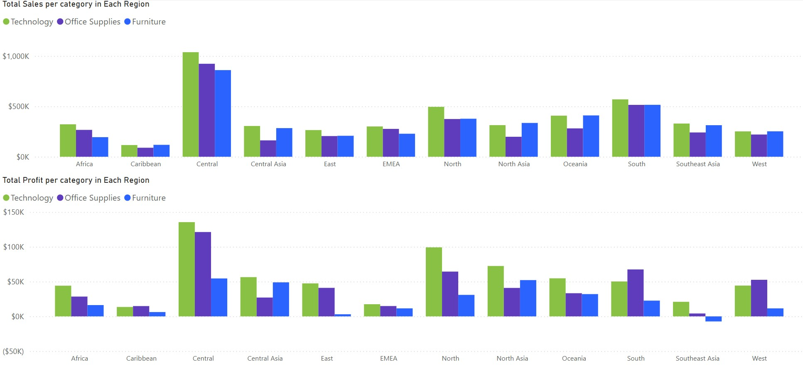
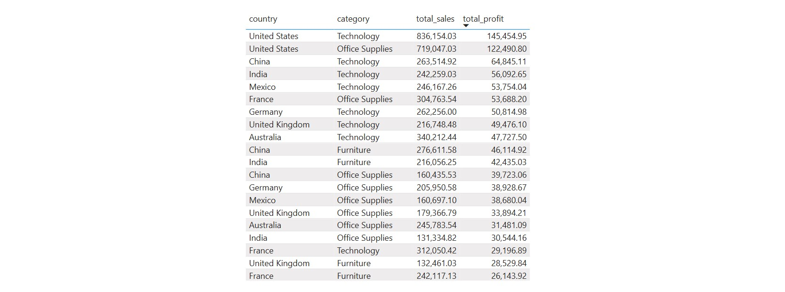
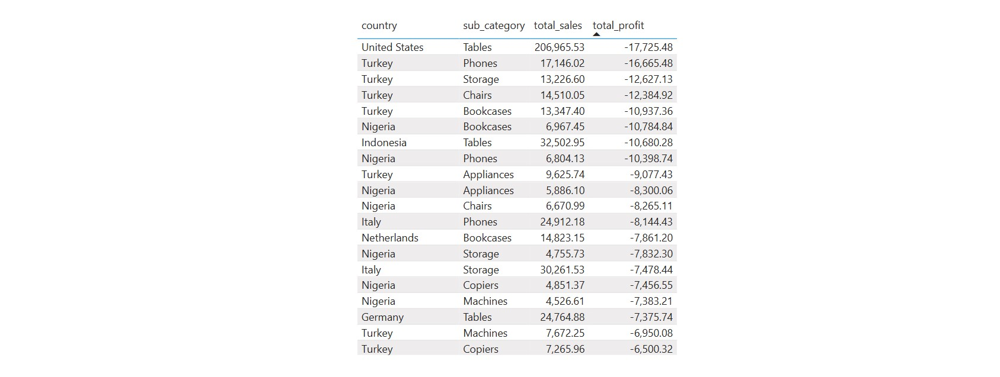
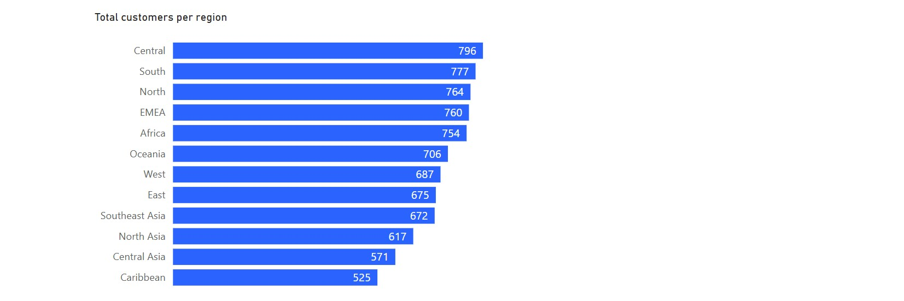
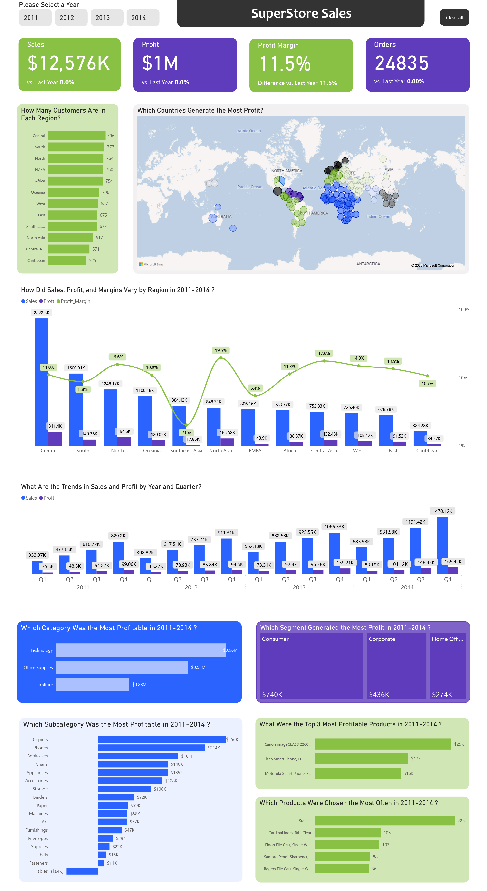

# Project Description
This project involves reformatting and analyzing Superstore sales data to answer critical business questions while addressing issues such as incorrect data types and missing values. The primary goal is to extract actionable insights that can inform business strategies and enhance overall performance.

The analysis will utilize a combination of Excel, SQL, and PowerBI, following a structured approach to ensure comprehensive and reliable results. The process will encompass six key parts of data analysis:

* [Defining the Problem](#defining-the-problem)
* [Data Preparation](#data-preparation)
* [Data Cleaning and Processing](#data-cleaning-and-processing)
* [Data Analysis](#data-analysis) 
* [Data Visualization](#data-visualization)
* [Recommendations](#recommendations)


  
## Defining the Problem
#### Which products, locations, and customer segments should the company focus on and which should it avoid to maximize profits?
What trends are emerging and what recommendations can be made based on the analysis findings?

## Data Preparation
* Data source: Datacamp.com 
* Superstore data includes two tables: orders and products
* Orders table contains 50,906 rows and 22 columns, covering orders from 2011-2014
* Products table contains 10,292 rows and 5 columns, covering products in 3 categories: technology, furniture, and office supplies


Model view shows us the contents of two tables, with product_id acting as the primary key. In the orders table, product_id serves as the foreign key that links to the products table's primary key. This relationship allows us to join the two tables and enrich our order data with additional product details, ensuring a comprehensive dataset for analysis.

## Data Cleaning and Processing
#### Tools: Excel, MySQL
* Observation of data in Excel
* Checking for missing data using filters and conditional formatting
* Removing duplicates
* Formatting columns (dates, numbers, currency)
* Filling in missing data in MySQL

Let's start by loading the data into SQL. From our initial analysis in Excel, we discovered that there are missing values in the quantity column. First, we'll identify these missing values to understand the gaps in our data.
Next, we'll calculate the unit price for the rows where quantity is available. This will involve dividing sales by quantity. With these unit prices in hand, we'll then estimate the missing quantities for the rows where quantity is NULL. We'll achieve this by joining the data on common attributes like product_id and discount.
To manage this process efficiently, we'll create a temporary table named calculated_quantities to store the missing values. Finally, we'll update the orders table, filling in the missing quantity values with our calculated amounts. This structured approach ensures our data's completeness and accuracy.

```sql
CREATE TEMPORARY TABLE calculated_quantities AS   -- Filling in missing quantity data
WITH missing_values AS (
  SELECT product_id, 
         discount, 
         region,
         sales
  FROM orders 
  WHERE quantity IS NULL   -- Find rows with NULL quantity
),
unit_price AS (
  SELECT 
    o.product_id,
    o.discount, 
    o.market, 
    o.region, 
    o.sales, 
    o.quantity, 
    o.sales / o.quantity AS unit_price 
  FROM orders AS o
  RIGHT JOIN missing_values AS m 
  ON o.product_id = m.product_id 
  AND o.discount = m.discount 
  WHERE o.quantity IS NOT NULL   -- Find rows with non-NULL quantity
)
SELECT 
  m.product_id, 
  m.discount, 
  m.region,
  m.sales, 
  ROUND((m.sales/u.unit_price), 0) AS calculated_quantity   -- Calculate missing quantity
FROM missing_values AS m 
INNER JOIN unit_price AS u 
ON m.product_id = u.product_id 
AND m.discount = u.discount;

UPDATE orders   -- Update table with calculated quantities
JOIN calculated_quantities
ON orders.product_id = calculated_quantities.product_id
AND orders.discount = calculated_quantities.discount
AND orders.sales = calculated_quantities.sales
SET orders.quantity = calculated_quantities.calculated_quantity
WHERE orders.quantity IS NULL;
```

## Data Analysis
#### Methods: SQL for exploratory data analysis, Power BI for visualization

### Main Questions:

[1. What are the total sales and total profits for each year?](#1-What-are-the-total-sales-and-total-profits-for-each-year)

[2. What are the total sales and total profits per quarter?](#2-What-are-the-total-sales-and-total-profits-per-quarter)

[3. Which region generates the highest sales and profits?](#3-Which-region-generates-the-highest-sales-and-profits)

[4. Which country and city bring in the highest sales and profits?](#4-Which-country-and-city-bring-in-the-highest-sales-and-profits)

[5. What is the relationship between discount and sales, and what is the total discount per category?](#5-What-is-the-relationship-between-discount-and-sales-and-what-is-the-total-discount-per-category)

[6. Which category generates the highest sales and profits in each region and country?](#6-Which-category-generates-the-highest-sales-and-profits-in-each-region-and-country)

[7. Which subcategory generates the highest sales and profits in each region and country?](#7-Which-subcategory-generates-the-highest-sales-and-profits-in-each-region-and-country)

[8. What are the names of the most and least profitable products?](#8-What-are-the-names-of-the-most-and-least-profitable-products)

[9. Which segment contributes the most to our profits and sales?](#9-Which-segment-contributes-the-most-to-our-profits-and-sales)

[10. How many unique customers do we have in total, and how many are there per region and country?](#10-How-many-unique-customers-do-we-have-in-total-and-how-many-are-there-per-region-and-country)

[11. Customer rewards program: Which customers bring the most profit?](#11-Customer-rewards-program-Which-customers-bring-the-most-profit)

[12. What is the average delivery time per class and in total?](#12-What-is-the-average-delivery-time-per-class-and-in-total)

### 1. What are the total sales and total profits for each year?
#### Total sales and profits per year
We can observe data for 2011, 2012, 2013, and 2014 based on grouping by year from the order dates.
```sql
 SELECT 
    YEAR(order_date) AS total_year, 
    ROUND(SUM(sales), 2) AS total_revenue, 
    ROUND(SUM(profit), 2) AS total_profit
  FROM orders
  GROUP BY  total_year
  ORDER BY total_year DESC;
```
The following output is produced by the above code:


The results show a consistent increase in both sales and profits from 2011 to 2014. Sales grew from 2250.94K in 2011 to 4276.7K in 2014, while profits rose from 247.13K in 2011 to 498.17K in 2014. This indicates a steady improvement in Superstore financial performance over the years.

### 2. What are the total sales and total profits per quarter?
Let's examine the total sales and profits per quarter. This analysis helps identify the periods when our company has had the most significant impact. By doing this, we can tailor our future operations to maximize our resources, such as advertising, customer service, and overall presence during those times of the year.

#### Best performing quarters from 2011-2014
```sql
WITH cte AS (
  SELECT 
    QUARTER(o.order_date) AS revenue_quarter,
    ROUND(SUM(o.sales), 2) AS total_sales
  FROM orders AS o
  LEFT JOIN products AS p
  ON o.product_id = p.product_id
  GROUP BY revenue_quarter
  ORDER BY revenue_quarter DESC
)
SELECT 
  CASE 
    WHEN revenue_quarter = 1 THEN 'Q1'
    WHEN revenue_quarter = 2 THEN 'Q2'
    WHEN revenue_quarter = 3 THEN 'Q3'
    ELSE 'Q4'
  END AS quarters,
  total_sales
FROM cte
ORDER BY revenue_quarter DESC;
```


The results shown above can help us understand which quarters were the most profitable from 2011 to 2014, aiding in planning business areas like marketing, inventory levels, and optimizing human resources during peak periods. This can also pave the way for strategic investments.

#### Total sales and profits per quarter

```sql
SELECT 
    YEAR(o.order_date) AS revenue_year,
    QUARTER(o.order_date) AS revenue_quarter,
    ROUND(SUM((o.sales)), 2) AS total_sales
FROM orders AS o
LEFT JOIN products AS p
ON o.product_id = p.product_id
GROUP BY revenue_year, revenue_quarter
ORDER BY revenue_year DESC, revenue_quarter DESC;
```


The data reveals that the fourth quarter, encompassing October, November, and December, is our peak period for sales and profits. By analyzing this data, we can develop effective operational strategies, noting the clear buildup from January to December, followed by a dip in the first three months of the year. 
Let's now take a look at how sales and profits are distributed across the different regions.

### 3. Which region generates the highest sales and profits?

#### Total sales, profits, and profit margins by region

This can be verified with the help of the following query:

```sql
SELECT 
  region, 
  ROUND(SUM(sales), 2) AS total_sales,
  ROUND(SUM(profit), 2) AS total_profit,
  ROUND((SUM(profit) / SUM(sales)) * 100, 2) AS profit_margin
FROM orders
GROUP BY region
ORDER BY total_sales DESC;
```


We can observe that the Central region has the highest total sales and brings us substantial profits. The North region also demonstrates strong performance with a high profit margin. These two regions are definitely areas of interest if we want to maximize our profits and expand our business. The South region, while generating substantial revenue, has a comparatively lower profit margin, indicating potential areas for efficiency improvements.

On the other hand, the Southeast Asia region, despite generating significant revenue, has a much lower profit margin. This region should be closely monitored as we might consider reallocating resources to more profitable areas. When we look at profit margins, which measure a company’s profitability as the percentage of revenue kept as profit, it reveals that the North and North Asia regions are particularly effective. Despite having lower total sales, these regions maintain high profit margins, showcasing efficient operations.

While the other regions, such as Oceania, EMEA, Africa, Central Asia, West, East, and the Caribbean, show moderate performance, they do not require immediate attention. Our primary focus should be on the Central, North, South, and North Asia regions for optimizing overall performance.

By considering these insights, we can develop targeted strategies for each region, maximizing our efficiency and profitability.

#### Average Order Value (AOV) and Average Number of Products per Order by region
Now, let's perform an analysis of the average order value and the average number of products per order by region. This will help us identify patterns and areas for improvement in our sales strategy.
```sql
SELECT
  region,
  ROUND(SUM(sales) / COUNT(DISTINCT order_id), 2) AS average_order_value,
  ROUND(SUM(quantity) / COUNT(DISTINCT order_id), 2) AS average_products_per_order
FROM orders
GROUP BY region
ORDER BY average_order_value DESC;
```


Based on the above results, we can see that North Asia and Central Asia show high average order values, which could be further leveraged with targeted promotions. In contrast, EMEA and Africa present opportunities to increase both order values and the number of products per order through strategic initiatives.
These insights will help us tailor our marketing and sales strategies to maximize performance across different regions.

### 4. Which country and city bring in the highest sales and profits?

Let's discover which countries are top performers and which need improvement.

#### Top 10 countries' total sales and profits with their profit margins
```sql
SELECT 
  country, 
  ROUND(SUM(sales), 2) AS total_sales,
  ROUND(SUM(profit), 2) AS total_profit,
  ROUND((SUM(profit) / SUM(sales)) * 100, 2) AS profit_margin
FROM orders
GROUP BY country
ORDER BY total_profit DESC
LIMIT 10;

```


The most profitable countries are the United States, China, and India, with high sales and profit margins. For example, China has a profit margin of 21.5%, indicating efficient operations. Boosting resources and customer service in these countries is essential.

#### Bottom 10 countries' total sales and profits
```sql
SELECT 
  country, 
  ROUND(SUM(sales), 2) AS total_sales,
  ROUND(SUM(profit), 2) AS total_profit,
  ROUND((SUM(profit) / SUM(sales)) * 100, 2) AS profit_margin
FROM orders
GROUP BY country
ORDER BY total_profit ASC
LIMIT 10;
```


Conversely, our least profitable markets include Turkey, Nigeria, and the Netherlands, with significant losses. Nigeria, for instance, has a negative profit margin of -148.57%, making it the least profitable. For countries with low profit margins, it is crucial to conduct a market analysis to decide where it is worth developing further, as some of these markets may present substantial challenges. For instance, certain markets might not be strategic for further investment due to economic or market conditions. Therefore, thorough market analysis is necessary to make further decisions.

#### Top 10 cities' total sales and profits with their profit margins
```sql
SELECT 
  country, 
  city,
  ROUND(SUM(sales), 2) AS total_sales,
  ROUND(SUM(profit), 2) AS total_profit,
  ROUND((SUM(profit) / SUM(sales)) * 100, 2) AS profit_margin
FROM orders
GROUP BY country, city
ORDER BY total_profit DESC
LIMIT 10;
```


#### Bottom 10 cities' total sales and profits with their profit margins
```sql
SELECT 
  country, 
  city,
  ROUND(SUM(sales), 2) AS total_sales,
  ROUND(SUM(profit), 2) AS total_profit,
  ROUND((SUM(profit) / SUM(sales)) * 100, 2) AS profit_margin
FROM orders
GROUP BY country, city
ORDER BY total_profit ASC
LIMIT 10;
```


The top cities that we should focus on are New York City, Seattle, and San Salvador. New York City has a profit margin of 24.2%, showing substantial profitability. These cities are key markets and require optimized strategies. The bottom 3 cities are Lagos, Istanbul, and Philadelphia. Lagos, with a profit margin of -150.84%, indicates significant inefficiencies. Similar to our approach with countries, it is essential to analyze these cities' market conditions to determine the feasibility of improvement and potential investments.

### 5. What is the relationship between discount and sales, and what is the total discount per category?

First, let’s examine the correlation between discount and average sales to understand how one affects the other.
#### Discount vs Avg Sales
```sql
SELECT 
  discount, 
  ROUND(AVG(sales), 2) AS avg_sales
FROM orders
GROUP BY discount
ORDER BY discount;
```


#### Correlation
```sql
WITH stats AS (
    SELECT 
        discount,
        AVG(sales) AS Avg_Sales,
        COUNT(*) AS n,
        SUM(discount) AS sum_x,
        SUM(AVG(sales)) OVER() AS sum_y,
        SUM(discount * AVG(sales)) OVER() AS sum_xy,
        SUM(discount * discount) AS sum_xx,
        SUM(AVG(sales) * AVG(sales)) OVER() AS sum_yy
    FROM orders
    GROUP BY discount
)
SELECT 
    (SUM(n) * SUM(sum_xy) - SUM(sum_x) * SUM(sum_y)) / 
    SQRT((SUM(n) * SUM(sum_xx) - SUM(sum_x) * SUM(sum_x)) * 
         (SUM(n) * SUM(sum_yy) - SUM(sum_y) * SUM(sum_y))) AS correlation_coefficient
FROM stats;
```

From the data, it seems that for each discount point, the average sales vary significantly.
They almost have no linear relationship, as indicated by the correlation coefficient of approximately 0.075  and the shape of the graph.
However, we can observe that at discount points of 7%, 35%, 55% and 57% our average sales are the highest. This might be due to psychological factors or simply because the right product category is being discounted.

#### Most discounted categories
Now, let's examine the total discount for each product category.
```sql
SELECT 
  p.category, 
  SUM(o.discount) AS total_discount
FROM orders AS o 
LEFT JOIN products AS p
ON o.product_id = p.product_id
GROUP BY category
ORDER BY total_discount DESC;
```


Office Supplies are the most heavily discounted items, followed by Furniture and Technology. In the subsequent steps, we will explore the profit and sales generated by each subcategory. But first, let's take a closer look at the categories to identify which specific products receive the highest discounts.

#### Most discounted subcategories
```sql
SELECT 
  p.sub_category, 
  SUM(o.discount) AS total_discount
FROM orders AS o 
LEFT JOIN products AS p
ON o.product_id = p.product_id
GROUP BY p.sub_category
ORDER BY total_discount DESC;
```


The chart clearly shows that Binders receive the highest discounts, followed by Storage and Art. Notable discounts are also seen in Phones, Chairs, and Paper.
These discounts are spread across various subcategories, with Binders and Storage standing out. This could indicate a strategic focus on promoting these items.
To gain a deeper understanding, let's examine the sales and profits for Binders and other discounted products. After that, we'll shift our attention to the categories based on different regions and countries.

### 6. Which category generates the highest sales and profits in each region and country?
Before we analyze how it looks in countries and regions, let's see the overall view.
#### Categories with their total sales, profits, and profit margins
```sql
SELECT 
  p.category,
  ROUND(SUM(o.sales), 2) AS total_sales,
  ROUND(SUM(o.profit), 2) AS total_profit,
  ROUND(SUM(o.profit) / SUM(o.sales) * 100, 2) AS profit_margin
FROM orders AS o 
LEFT JOIN products AS p 
ON o.product_id = p.product_id
GROUP BY p.category
ORDER BY total_profit DESC;
```


While Technology generates the highest sales and profit margins, Furniture, despite significant sales, yields the lowest profit margin. Office Supplies maintain a consistent profit margin close to Technology, with rates of 13.91% and 13.59% respectively, making them the best investment options. Furniture, although profitable, does not convert as effectively. Let's further explore how these figures appear across different regions.

#### Highest total sales and profits per category in each region
```sql
SELECT 
  o.region,
  p.category,
  ROUND(SUM(o.sales), 2) AS total_sales,
  ROUND(SUM(o.profit), 2) AS total_profit
FROM orders AS o 
LEFT JOIN products AS p 
ON o.product_id = p.product_id
GROUP BY o.region, p.category
ORDER BY total_profit DESC;
```



Technology leads in total sales and profits across most regions. The Central region excels with high sales and profits across all categories, with only Furniture generating similar high profits in North Asia as in Central. Despite high sales, the Southeast Asia region fares the worst in the Furniture category, showing a loss. 

#### Highest total sales and profits per category in each country
```sql
SELECT 
  o.country,
  p.category,
  ROUND(SUM(o.sales), 2) AS total_sales,
  ROUND(SUM(o.profit), 2) AS total_profit
FROM orders AS o 
LEFT JOIN products AS p 
ON o.product_id = p.product_id
GROUP BY o.country, p.category
ORDER BY total_profit DESC
LIMIT 20;
```


Our analysis reveals that the United States leads in both Technology and Office Supplies, demonstrating the strongest performance overall.

#### Lowest total sales and profits per category in each country
```sql
SELECT 
  o.country,
  p.category,
  ROUND(SUM(o.sales), 2) AS total_sales,
  ROUND(SUM(o.profit), 2) AS total_profit
FROM orders AS o 
LEFT JOIN products AS p 
ON o.product_id = p.product_id
GROUP BY o.country, p.category
ORDER BY total_profit ASC
LIMIT 20;
```


Our biggest losses are in Turkey and Nigeria across all categories. Let's take a closer look at how this plays out in the subcategories.


### 7. Which subcategory generates the highest sales and profits in each region and country?

#### Subcategories with their total sales, profits, and profit margins

This question can be answered with the following query: 
```sql
SELECT 
  p.sub_category,
  ROUND(SUM(o.sales), 2) AS total_sales,
  ROUND(SUM(o.profit), 2) AS total_profit,
  ROUND(SUM(o.profit) / SUM(o.sales) * 100, 2) AS profit_margin
FROM orders AS o 
LEFT JOIN products AS p 
ON o.product_id = p.product_id
GROUP BY p.sub_category
ORDER BY total_profit DESC;
```


Our biggest profits come from Copiers, Phones, and Accessories. The profits and profit margins on Copiers and Phones, in particular, are promising for the long run. Our losses come from Tables, where we are unable to break even. This subcategory should be further reviewed as sales are present, but we cannot generate profits from them.

#### Subcategories with the highest total sales and profits in each region

Now let’s have a look at the highest total sales and total profits per subcategory in each region:

```sql
SELECT 
  p.sub_category,
  ROUND(SUM(o.sales - o.discount), 2) AS total_sales,
  ROUND(SUM(o.profit), 2) AS total_profit
FROM orders AS o
LEFT JOIN products AS p 
ON o.product_id = p.product_id
GROUP BY p.sub_category
ORDER BY total_profit DESC
LIMIT 20;
```


The best subcategories when it comes to sales and profit are Phones in the Central Region.

#### Subcategories with the lowest total sales and profits in each region

Now let’s see the least performing ones: 

```sql
SELECT 
  p.sub_category,
  ROUND(SUM(o.sales - o.discount), 2) AS total_sales,
  ROUND(SUM(o.profit), 2) AS total_profit
FROM orders AS o
LEFT JOIN products AS p 
ON o.product_id = p.product_id
GROUP BY p.sub_category
ORDER BY total_profit ASC
LIMIT 20;
```


Tables are our biggest losses in profits in the South, Central, Southeast Asia, East, and North Asia. Next, let’s see the highest total sales and total profits per subcategory in each country.


#### Highest total sales and profits per subcategory in each country
```sql
SELECT 
  o.country,
  p.sub_category,
  ROUND(SUM(o.sales - o.discount), 2) AS total_sales,
  ROUND(SUM(o.profit), 2) AS total_profit
FROM orders AS o
LEFT JOIN products AS p 
ON o.product_id = p.product_id
GROUP BY p.sub_category, o.country
ORDER BY total_profit DESC
LIMIT 20;
```


The United States dominates the list, particularly with subcategories like Copiers, Phones, and Accessories, achieving the highest profits. China follows with significant profits in Copiers and Bookcases, while India shows strong performance in Phones. This indicates that the US market is currently the most lucrative across various subcategories.

#### Lowest total sales and profits per subcategory in each country
Let’s see the lowest sales and profits:
```sql
SELECT 
  o.country,
  p.sub_category,
  ROUND(SUM(o.sales - o.discount), 2) AS total_sales,
  ROUND(SUM(o.profit), 2) AS total_profit
FROM orders AS o
LEFT JOIN products AS p 
ON o.product_id = p.product_id
GROUP BY p.sub_category, o.country
ORDER BY total_profit ASC
LIMIT 20;
```



The subcategories causing the most losses are Tables, Phones, and Bookcases. These losses are particularly significant in the United States, Turkey, and Nigeria, where all categories are facing substantial negative profits. By identifying these problematic subcategories and regions, we can focus our efforts on developing strategies to mitigate these losses and improve overall profitability.

### 8. What are the names of the most and least profitable products?

It's time to look at the specific products that drive our business and generate profits. By identifying the most and least profitable products, we can strategically focus on enhancing our strengths and addressing any weaknesses in our inventory.

#### Top 10 most profitable products
```sql
SELECT 
  p.product_name,
  ROUND(SUM(o.sales - o.discount), 2) AS total_sales,
  ROUND(SUM(o.profit), 2) AS total_profit
FROM orders AS o
LEFT JOIN products AS p 
ON o.product_id = p.product_id
GROUP BY p.product_name
ORDER BY total_profit DESC
LIMIT 10;
```


The most profitable products mainly include advanced copiers, smart phones, and office furniture, indicating strong demand and high profit margins in these categories. The Canon imageCLASS 2200 Advanced Copier, Cisco Smart Phone, and Motorola Smart Phone are the main foundations of our profits. These top-performing products are essential to maintain in our stock due to their significant contribution to our overall profitability.

#### Top 10 least profitable products
```sql
SELECT 
  p.product_name,
  ROUND(SUM(o.sales - o.discount), 2) AS total_sales,
  ROUND(SUM(o.profit), 2) AS total_profit
FROM orders AS o
LEFT JOIN products AS p 
ON o.product_id = p.product_id
GROUP BY p.product_name
ORDER BY total_profit ASC
LIMIT 10;
```


On the other hand, the least profitable products include 3D printers, cordless phones, and office tables, which may need further evaluation to understand the reasons behind their low profitability. The Cubify Cubex 3D Printer Double Head Print, Lexmark X1150 Inkjet Monochrome Laser Printer, and Motorola Smart Phone, Cordless operate at the most significant losses. We should consider this when evaluating our inventory and potentially adjusting our stock strategies.

### 9. Which segment contributes the most to our profits and sales?

#### Segments ordered by total profits
Let's verify this with the following query:
```sql
SELECT 
  segment, 
  ROUND(SUM(sales), 2) AS total_sales, 
  ROUND(SUM(profit), 2) AS total_profit
FROM orders
GROUP BY segment
ORDER BY total_profit DESC;
```


 The Consumer segment generates the highest profit, followed by the Corporate segment, and lastly the Home Office segment.
### 10. How many unique customers do we have in total, and how many are there per region and country?

#### Total number of customers
```sql
SELECT 
  COUNT(DISTINCT customer_id) AS total_customers
FROM orders;
```


We’ve had 1590 customers between 2011 and 2014.

-- Total customers per region

```sql
SELECT 
  region, 
  COUNT(DISTINCT customer_id) AS total_customers
FROM orders
GROUP BY region
ORDER BY total_customers DESC;
```


The central region had the highest number of customers. The discrepancy from the total of 1590 is due to customer migration between regions. And how does it look in individual countries?

#### Top 10 countries with the most customers
```sql
SELECT 
  country, 
  COUNT(DISTINCT customer_id) AS total_customers
FROM orders
GROUP BY country
ORDER BY total_customers DESC
LIMIT 10;
```


#### Countries with the fewest customers
```sql
SELECT 
  country, 
  COUNT(DISTINCT customer_id) AS total_customers
FROM orders
GROUP BY country
ORDER BY total_customers ASC
LIMIT 20;
```


The United States and France have the highest number of customers, indicating strong and stable markets, with Mexico, Australia, and Germany also being key regions. Conversely, countries like Chad and Eritrea show minimal customer numbers, highlighting potential challenges. Focusing on successful markets and analyzing weaker ones can optimize strategies.

### 11. Customer rewards program: Which customers bring the most profit?


#### Top 10 customers who generated the most sales compared to total profits
```sql
SELECT 
  customer_id, 
  ROUND(SUM(sales), 2) AS total_sales,
  ROUND(SUM(profit), 2) AS total_profit
FROM orders
GROUP BY customer_id
ORDER BY total_sales DESC
LIMIT 10;
```


By identifying high-spending customers, we can build a valuable loyalty and rewards program. Retaining existing customers is cheaper than acquiring new ones, so analyzing total profits is crucial. For example, customer ID ‘SM-20320’ spends a lot but isn’t profitable, yet their loyalty must be rewarded. Meanwhile, customer ID ‘TC-20980’ is the most profitable. By rewarding and retaining these top customers, we ensure their continued loyalty.

### 12. What is the average delivery time per class and in total?
At the end, let's analyze delivery time using the following queries:
#### Average delivery time
```sql
SELECT 
  AVG(DATEDIFF(ship_date, order_date)) AS delivery_time
FROM orders;
```


#### Calculate delivery time and percentage of total orders
```sql
WITH delivery AS (
  SELECT 
    order_id,
    order_date,
    ship_date,
    DATEDIFF(ship_date, order_date) AS delivery_time,
    quantity
  FROM orders
),
total_orders AS (
  SELECT COUNT(order_id) AS total_order_count FROM delivery
)
SELECT 
  delivery_time, 
  COUNT(order_id) AS order_count,
  ROUND((COUNT(order_id) / (SELECT total_order_count FROM total_orders)) * 100, 2) AS percentage_of_total
FROM delivery
GROUP BY delivery_time
ORDER BY delivery_time DESC;
```


#### Avg delivery time and standard deviation per region
```sql
SELECT 
  region,
  AVG(DATEDIFF(ship_date, order_date)) AS average_delivery_time,
  STDDEV(DATEDIFF(ship_date, order_date)) AS stddev_delivery_time
FROM orders
GROUP BY region
ORDER BY average_delivery_time ASC;
```


#### Avg delivery time per  shipping mode
```sql
SELECT 
  ship_mode,
  AVG(DATEDIFF(ship_date, order_date)) AS avg_delivery_time
FROM orders
GROUP BY ship_mode
ORDER BY avg_delivery_time DESC;
```


The standard deviation of around 1.75 indicates that delivery times are close to the average (3.97 days), showing consistency and stability in logistics across regions. Only two orders required delivery over 2 days. Since most orders are fulfilled within 1-5 days, focusing on this timeframe can enhance efficiency and customer satisfaction.


## Data Visualization
#### Tool: PowerBI

To wrap things up, let's take another look at the Power BI report below.



## Recommendations

Based on the analyzed data, here are my key findings to ensure the success of Superstore.

* Our profits and sales steadily increased over the analyzed quarters from 2011 to 2014. We should maintain this growth. Q4 is our most profitable quarter. To maximize profits, we need to ensure adequate stock and strengthen marketing and customer service from October to December.

* The Central region has the highest total sales and brings us significant profits, generating at least $1,221.00 more in sales than the next highest region, the South. The South region, despite substantial revenue, has a relatively lower profit margin, indicating potential efficiency improvements. The North region also shows strong performance with a high-profit margin. These two regions (Central and North) are areas of interest if we want to maximize our profits and expand our business. Southeast Asia, despite high sales, has significantly lower profit margins. It might be more beneficial to redirect resources from this region to the Central region, where we are more profitable and can solidify our leadership. Regions like Oceania, EMEA, Africa, Central Asia, West, East, and the Caribbean show moderate performance and do not require immediate attention.

* The United States, China, and India are our most profitable markets in terms of sales and profit margins. We should focus more on these countries. Turkey, Nigeria, the Netherlands, the Philippines, and Honduras are our least profitable markets. Consider reducing our presence or closing stores in these countries.

* New York, Los Angeles, and Seattle are our most profitable cities. It is easier to dominate a city than an entire country, so let's focus on these top cities. Two of the ten cities where we lose the most money are in Nigeria, indicating a need to reconsider our operations there. The better option would be to stop business in these cities.

* Technology and Office Supplies bring the highest profits and have good profit margins. We should continue investing in them. Furniture still makes profits but has lower overall returns. We need to find ways to improve this category's performance.

* Office Supplies in the Central, North, and South regions bring the highest profits and should have increased availability. The same applies to Technology. Furniture in Southeast Asia does not generate profits, so redirecting these resources to the Central or North Asia regions would be better.

* Canon imageClass 2200 Advanced Copier, Cisco Smart Phone (Full Size), and Motorola Smart Phone (Full Size) are our most profitable products. We must always keep these in stock. Cubify CubeX 3D Printer Double Head Print, Lexmark MX611dhe Monochrome Laser Printer, and Motorola Smart Phones (Cordless) should be discontinued.

* The consumer segment brings the most profit, followed by corporate and home office segments. We must focus more on the consumer segment, even if all three are profitable.

* We have a total of 1,590 customers, with the most customers in the USA, France, and Mexico. California and New York are obvious areas where we need to excel. The standard deviation of around 1.75 indicates that delivery times are close to the average (3.97 days), showing consistency and stability in logistics across regions.

Thank you for reviewing my analysis! I'm excited to invite you to explore my other portfolio projects.
